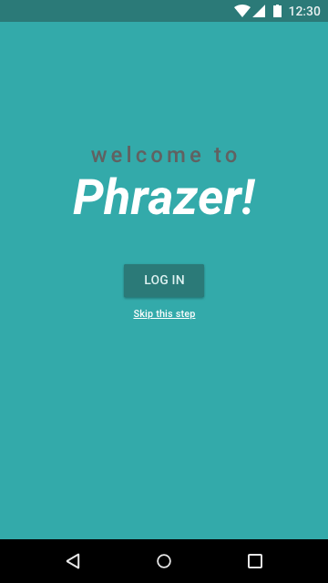
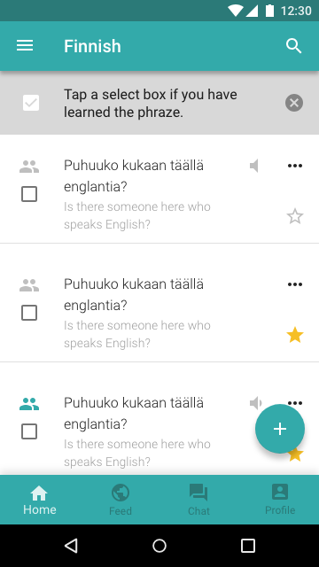
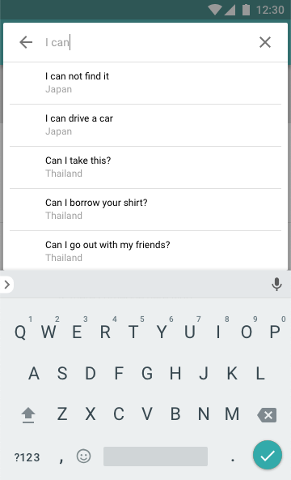

# Phrazer mobile application

> Dear visitor/future developer,
> Right now you are in the Master branch where the latest release of Phrazer mobile application is located. Don't be scared the development continues, but things we are working on aren't prepared for public release.

## Here is quick summary what you will find where!

Besides the branches named bellow others are created and deleted by the feature branch workflow. In short, branches are named after features which are being made in the branches.

- Master: Latest public release.
- Demo-1: Redesigned application prepared for presentation at HUMEX 5 December 2018.
- Demo-sounds: Original design application with the social network part.
- Server: As the name suggests this is where the latest release of server part of the app is located.

## Design preview

### Landing screen

### Home screen

### Search

### Add New Phraze (Blank)
.png)

### Add New Phraze (Recording)
.png)
